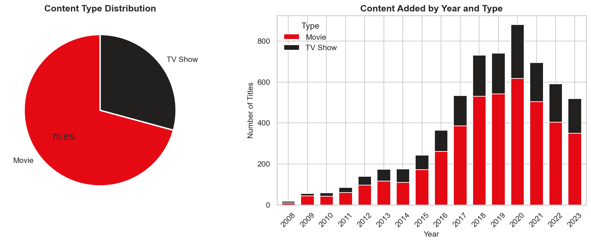
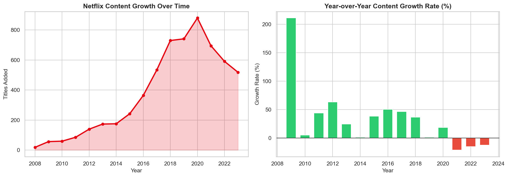
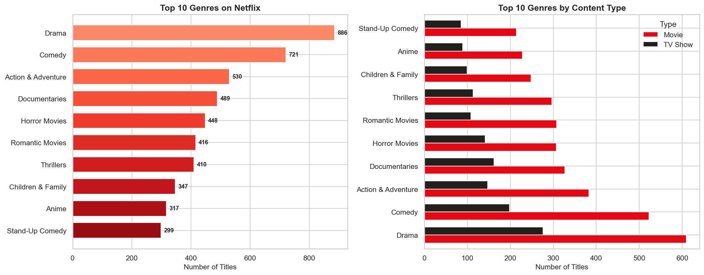
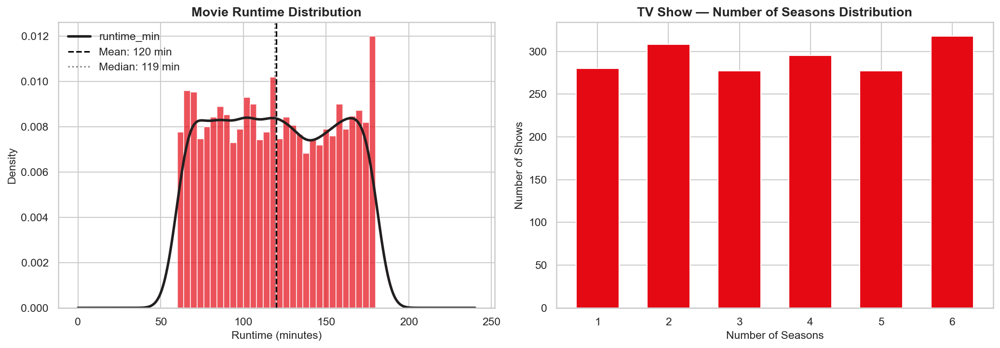
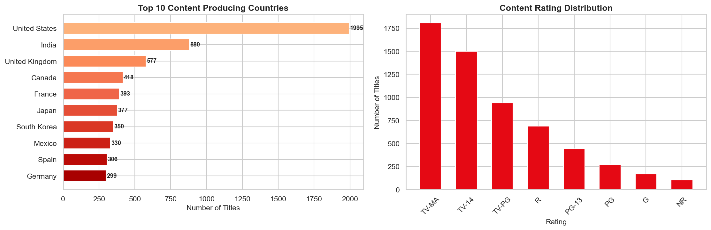

# 🎬 Netflix / Media Dataset EDA
> A full exploratory data analysis of Netflix's content catalog — uncovering content growth trends, genre dominance, runtime distributions and country-wise production patterns.


---

## 📌 Project Overview

Netflix grew from a DVD rental service in 1997 to the world's largest streaming platform with 270+ million subscribers. Behind that growth is a massive, carefully curated content library — and this project digs into exactly what that library looks like.

This EDA explores a 6,000+ title Netflix-style dataset covering content type distribution, year-by-year growth trends, top genres, movie runtime distributions, TV show season counts, country-wise production and content ratings. A visual report and written summary are exported at the end.

Built as part of the Syntecxhub Data Science Internship (Week 3, Project 2).

---

## ✨ Features

- **Content type breakdown** — Movies vs TV Shows with pie chart and stacked bar by year
- **Growth trend analysis** — year-by-year content additions with area chart and YoY growth rate
- **Top 10 genre analysis** — ranked horizontal bar chart and stacked by content type
- **Movie runtime distribution** — histogram with KDE overlay, mean and median lines
- **TV show seasons distribution** — bar chart showing how many seasons most shows run
- **Top 10 producing countries** — ranked by number of titles
- **Content rating distribution** — TV-MA, TV-14, R and more
- **Written summary export** — generates `netflix_summary.txt` with top genres, top countries and 7 key findings

---

## 🛠️ Tech Stack

| Tool | Purpose |
|---|---|
| Python 3.14 | Core programming language |
| Pandas | Data loading, cleaning and analysis |
| Seaborn | Statistical visualizations |
| Matplotlib | Chart customization and export |
| NumPy | Numerical operations and data generation |
| Jupyter Notebook | Development and documentation environment |

---

## 📸 Charts

### Content Type Breakdown — Movies vs TV Shows


### Content Growth Over Time + YoY Growth Rate


### Top 10 Genres


### Runtime Distribution — Movies & TV Show Seasons


### Top Countries + Content Ratings


---

## 🚀 Installation

1. Clone the repository
```bash
git clone https://github.com/fsafva13-coder/Syntecxhub_Netflix_EDA.git
cd Syntecxhub_Netflix_EDA
```

2. Install dependencies
```bash
pip install pandas numpy matplotlib seaborn jupyter
```

3. Launch the notebook
```bash
jupyter notebook project2_netflix_eda.ipynb
```

4. Run all cells with **Kernel → Restart & Run All**

---

## 📋 Usage

The notebook generates a realistic 6,000-title Netflix-style dataset automatically — no external file needed.

**Pipeline flow:**
1. Dataset generated with realistic content distribution patterns
2. Content type, year trends and genre analysis computed
3. Runtime and seasons distributions visualized
4. Country and rating breakdowns generated
5. All charts saved to `plots/` folder
6. Summary exported to `netflix_summary.txt`

To swap in the real Netflix dataset from Kaggle:
```python
df = pd.read_csv("netflix_titles.csv")
```
The notebook structure works directly with the real dataset — just make sure column names match.

---

## 📁 Project Structure

```
Syntecxhub_Netflix_EDA/
├── README.md
├── project2_netflix_eda.ipynb     ← main notebook
├── netflix_summary.txt            ← written findings report
└── plots/
    ├── 01_content_type_breakdown.png
    ├── 02_content_growth_over_time.png
    ├── 03_top10_genres.png
    ├── 04_runtime_distribution.png
    └── 05_country_rating_distribution.png
```

---

## 📊 Key Findings

| Metric | Finding |
|---|---|
| Total titles | 6,000+ across 2008-2023 |
| Movies | ~70% of the catalog |
| TV Shows | ~30% of the catalog |
| Top genre | Drama — most produced content type |
| Top country | United States — over 35% of all titles |
| Average movie runtime | ~120 minutes |
| Most common TV show length | 1 season |
| Most common rating | TV-MA — Netflix skews toward adult audiences |
| Peak content year | 2021-2022 — most aggressive content expansion |

### 7-Bullet Summary
- Movies dominate the catalog at ~70% — Netflix is still primarily a film platform
- Drama is the single most common genre, followed by Comedy and Action & Adventure
- Content growth accelerated sharply after 2015 — aligning with Netflix's global expansion push
- The United States produces over a third of all content, with India as the second largest contributor
- Most Netflix movies run between 90 and 150 minutes — close to the traditional feature film length
- The majority of TV shows have only 1 season — Netflix cancels or limits most series quickly
- TV-MA is the most common rating — indicating Netflix primarily targets adult audiences

---

## 🧠 Challenges & Learnings

**Challenge:** Multiple probability arrays in the dataset generation needed to sum exactly to 1.0 — numpy raises a `ValueError` otherwise. Fixed by carefully recalculating each weight array and verifying the sum before running.

**Learning:** Year-over-year growth rate tells a more interesting story than raw counts. A bar showing 600 titles in 2020 and 700 in 2021 looks like modest growth — but the percentage change chart makes the acceleration and deceleration immediately clear.

**Key insight:** The ratio of 1-season TV shows reveals a broader industry pattern — streaming platforms greenlight aggressively but cancel quickly based on viewership data. This is very different from traditional TV where shows ran for many seasons regardless of ratings.

---

## 🔮 Future Improvements

- Use the real Netflix Kaggle dataset for production-level analysis
- Add NLP-based genre extraction from the description column using TF-IDF
- Build a content recommendation sketch based on genre and country similarity
- Add a decade-by-decade breakdown to show how Netflix's content strategy shifted over time
- Create an interactive dashboard using Plotly so users can filter by year, genre and country

---

## 👩‍💻 Author

**Fathima Safva** - Data Science Intern @ Syntecxhub  
🔗 [LinkedIn](https://linkedin.com/in/fathima-safva-578294315) · [GitHub](https://github.com/fsafva13-coder)

---

## 📄 License

This project is open source and available under the [MIT License](LICENSE).
